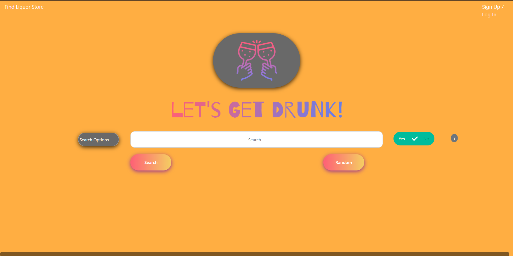
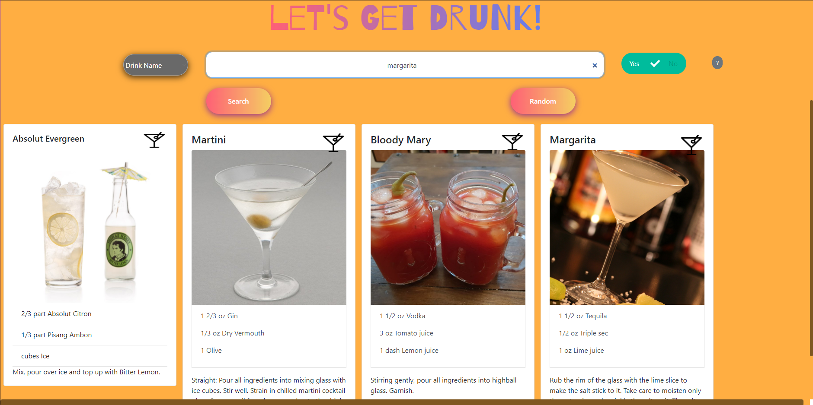
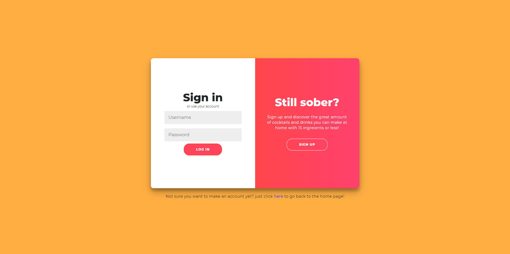
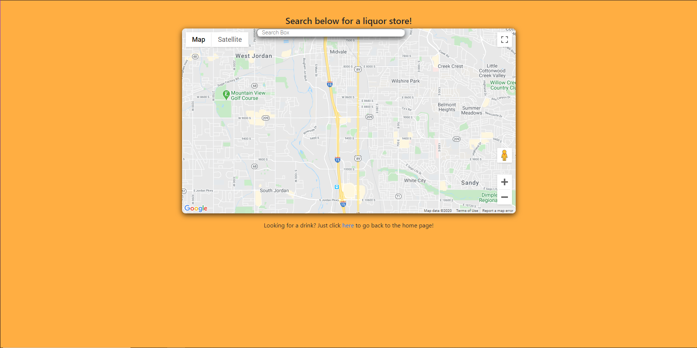

# Gigit

Full-stack application that gives you a place to search for different drinks and find liqour stores near you. 

## [Try it yourself!](https://project-2-cocktail-search.herokuapp.com/)

### Home Page



### Home Page With Searches



### Signup Page



### Google Maps Page



## Getting Started

These instructions will get you a copy of the project up and running on your local machine for 
development and testing purposes. They will also give an overview of some of the app's functionality. 

### Prerequisites

you will need mySQL installed if you want to run this applicaiton locally. For help installing mySQL, visit
````
https://dev.mysql.com/downloads/windows/installer/8.0.html
````

Once installed, make sure you also download the mySQL Workbench. for help installing the workbench, visit
````
https://dev.mysql.com/downloads/workbench/
````

### Installing

Git clone the repository to your local machine:

HTTPS:
````
$ git clone https://github.com/Braydon-Nelson/cocktail-search.git
````
SSH:
````
$ git clone git@github.com:Braydon-Nelson/cocktail-search.git
````

Next, cd into the repository you cloned and install the necessary dependencies by running:
````
$ npm i
````

You will then be able to start the app locally by running:
````
$ npm start
````

then you just open your browser and put this in the url box:
````
localhost:8080
````

## Built With

* [CSS](https://developer.mozilla.org/en-US/docs/Web/CSS) - Front-End style library
* [HTML](https://developer.mozilla.org/en-US/docs/Web/HTML) - Front-End library
* [JavaScript](https://developer.mozilla.org/en-US/docs/Web/javascript) - High level programming language
* [mySQL](https://www.mysql.com) - mySQL Database
* [Sequelize](https://sequelize.org) - mySql ORM library
* [Express.js](https://expressjs.com/) - Node.js framework
* [Node.js](https://nodejs.org/en/) - JavaScript runtime
* [CocktailDB API](https://www.thecocktaildb.com) - An open, crowd-sourced database of drinks and cocktails from around the world
* [Google Maps API](https://developers.google.com/maps/documentation/?_ga=2.31814078.185020172.1591293883-646983863.1591293883) - API that allows you to use Google maps for your application

## Authors

See the list of [contributors](https://github.com/Braydon-Nelson/cocktail-search/graphs/contributors) who participated 
in this project along with individual commit history. 

## Planned updates

At the moment, this app is a minimum viable product. We hope to update how the cards are added, it can be a bit buggy
at times. W also would like to add a favorite function that allows you to favorite drinks and then look at them in 
your account when you sign in. We would also like to make it so that the maps automatically shows you where the closest
liquor stores are. 
